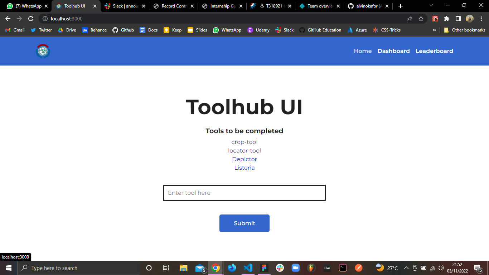

# Toolhub UI

[Website Link](https://toolhub-ui.netlify.app/)

## Tools used in this project
* JavaScript
* CSS
* React.js
* React Router

## Setup Instructions

To run the project locally on your machine, in the project directory, you can run:

### `npm start`

Runs the app in the development mode.\
Open [http://localhost:3000](http://localhost:3000) to view it in your browser.

The page will reload when you make changes.\
You may also see any lint errors in the console.

## Project overview

The website contains three pages: Home, Dashboard and Leaderboard

* Home Page: On this page you can add a tool and submit

* Dashboard Page: On this page you can view different analytics pertaining 
  to missing tools, edited tools, percentage of tools with missing information 
  and total number of tools.
  
* Leaderboard Page: On this page you can view top contributors to the toolhub project  

## Project Preview

